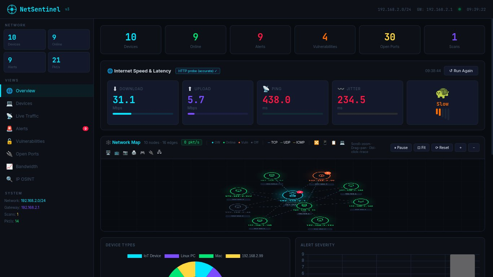

<div align="center">

<pre>
███╗   ██╗███████╗████████╗███████╗███████╗███╗   ██╗████████╗██╗███╗   ██╗███████╗██╗
████╗  ██║██╔════╝╚══██╔══╝██╔════╝██╔════╝████╗  ██║╚══██╔══╝██║████╗  ██║██╔════╝██║
██╔██╗ ██║█████╗     ██║   ███████╗█████╗  ██╔██╗ ██║   ██║   ██║██╔██╗ ██║█████╗  ██║
██║╚██╗██║██╔══╝     ██║   ╚════██║██╔══╝  ██║╚██╗██║   ██║   ██║██║╚██╗██║██╔══╝  ██║
     ██║ ╚████║███████╗   ██║   ███████║███████╗██║ ╚████║   ██║   ██║██║ ╚████║███████╗███████╗
     ╚═╝  ╚═══╝╚══════╝   ╚═╝   ╚══════╝╚══════╝╚═╝  ╚═══╝   ╚═╝   ╚═╝╚═╝  ╚═══╝╚══════╝╚══════╝
</pre>


**Real-time network monitoring, vulnerability detection & traffic analysis dashboard**

</div>

---

## 📸 Dashboard



---

## ✨ Features

- 🌐 **Live Network Map** — Interactive node graph with TCP/UDP/ICMP traffic visualization
- 📡 **Device Discovery** — Auto-detects all devices on the local subnet with OS fingerprinting
- ⚡ **Internet Speed & Latency** — HTTP probe for real-time download, upload, ping & jitter
- 🚨 **Alert Engine** — Severity-ranked alerts with live badge counters
- 🔒 **Vulnerability Scanner** — CVE-mapped open port and service analysis
- 📊 **Bandwidth Monitor** — Per-device packet rate tracking
- 🔍 **IP OSINT** — Geolocation, ASN, and threat intel lookups
- 🖥️ **Multi-view Sidebar** — Overview, Devices, Live Traffic, Alerts, Vulnerabilities, Open Ports

---

## 🚀 Installation

### 1. Clone the Repository

```bash
git clone https://github.com/spiderxploit/netsentinel.git
```

### 2. Navigate into the Project

```bash
cd netsentinel
```

### 3. Activate the Virtual Environment

**macOS / Linux:**
```bash
source venv/bin/activate
```

**Windows:**
```bash
source venv/Scripts/activate
```

### 4. Install Dependencies

```bash
pip install -r requirements.txt
```

---

## ▶️ Usage

**macOS / Linux:**
```bash
python3 netsentinel.py
```

**Windows:**
```bash
python netsentinel.py
```

Then open your browser and navigate to:

```
http://localhost:5000
```

---

## 🗂️ Project Structure

```
netsentinel/
├── netsentinel.py       # Main application entry point
├── requirements.txt     # Python dependencies
├── dashboard.png        # UI screenshot
└── README.md
```

---

## ⚙️ Requirements

- Python 3.8 or higher
- A virtual environment (`venv`) — included in the repo
- Network interface with access to the local subnet
- Root / Administrator privileges recommended for full packet capture

---

## 🤝 Contributing

Pull requests are welcome. For major changes, please open an issue first to discuss what you'd like to change.

---

## 📄 License

MIT © [spiderxploit](https://github.com/spiderxploit)

---

<div align="center">
<sub>Built with 🖤 for network defenders and red teamers</sub>
</div>